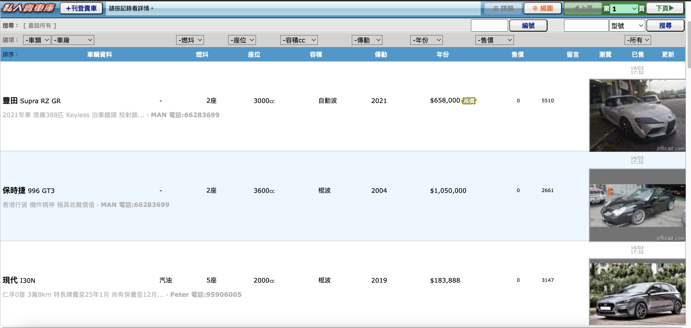

# Chrome extension for displaying car image on 28 car listing page

**How it works**

1. Redirects from 28car.com to corresponding iframe that allows script to access the content.
2. Retrieves the car detail URL and use an iframe to load the first image and create the image element with the corresponding image source before appending to the listing page.

**Installing**

1. Open Chrome and go to "chrome://extensions/"
2. Click on "Load Unpacked"
3. Select this "extension" directory